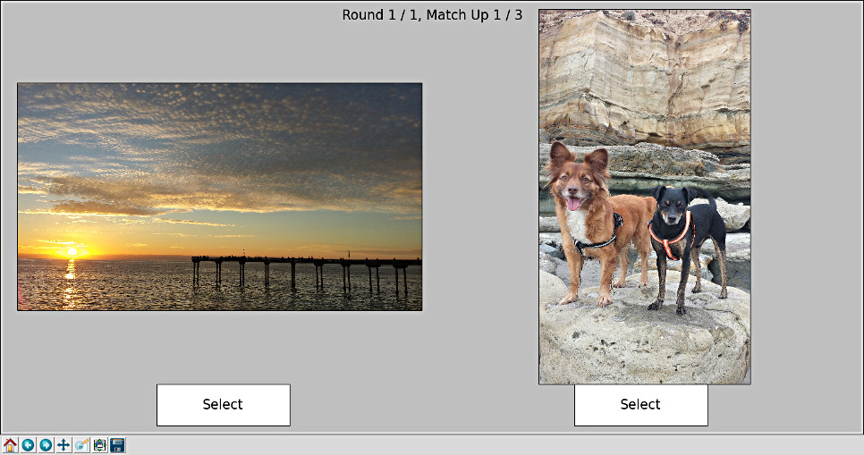

Photo Ranking With Python
=========================

.. hyper link references

.. _`Elo Ranking System`: http://en.wikipedia.org/wiki/Elo_rating_system
.. _`exifread`: https://pypi.python.org/pypi/ExifRead

What is this?
-------------

This is a tool that uses the `Elo Ranking System`_ written in Python using:

1. Matplotlib
2. Numpy
3. exifread

Features:

* Auto image rotation that the camera recored in the EXIF meta data
* Persistent state from execution to execution so you can pickup where you left off
* New photos that are added to the photo dir after initial ranking are picked up

Install dependencies
--------------------

Use your system's package manager to install Matplotlib & Numpy if you don't
already have them installed.

Next, you can use pip to install the EXIF image reader package `exifread`_:

.. code-block:: bash

    pip install exifread --user

How to rank photos
------------------

Once you have to dependencies installed, run ``rank_photos.py`` on the command
line passing it the directory of photos.

.. code-block:: bash

    ./rank_photos.py -h

    usage: rank_photos.py [-h] [-r N_ROUNDS] [-f FIGSIZE FIGSIZE] photo_dir

    Uses the Elo ranking algorithm to sort your images by rank. The program globs
    for .jpg images to present to you in random order, then you select the better
    photo. After n-rounds, the results are reported.

    positional arguments:
      photo_dir             The photo directory to scan for .jpg images

    optional arguments:
      -h, --help            show this help message and exit
      -r N_ROUNDS, --n-rounds N_ROUNDS
                            Specifies the number of rounds to pass through the
                            photo set (3)
      -f FIGSIZE FIGSIZE, --figsize FIGSIZE FIGSIZE
                            Specifies width and height of the Matplotlib figsize
                            (20, 12)

For example, iterate over all photos three times:

.. code-block:: bash

    ./rank_photos.py -r 3 ~/Desktop/example/

After the number of rounds complete, ``ranked.txt`` is written into the photo dir.

Ranking work is cached
----------------------

After completing N rounds of ranking, a file called ``ranking_table.json`` is
written into the photo dir.  The next time ``rank_photos.py`` is executed with
the photo dir, this table is read in and ranking can continue where you left
off.

You can also add new photos the the directory and they will get added to the
ranked list even though they weren't included previously.

Example
-------

Suppose there is a dir containing some photos:

.. code-block:: bash

    ls -1 ~/Desktop/example/

        20160102_164732.jpg
        20160109_151557.jpg
        20160109_151607.jpg
        20160109_152318.jpg
        20160109_152400.jpg
        20160109_152414.jpg
        20160109_153443.jpg

These photos haven't been ranked yet, so lets rank them, in this example, 1
round:

.. code-block:: bash

    ./rank_photos.py -r 1 ~/Desktop/example/

Once the number of rounds complete, the ranked list is dumped to the console:

.. code-block:: bash

    Final Ranking:
    Rank    Score    Matches    Win %    Filename
       1    1433          2     100.00    20160109_152414.jpg
       2    1414          3      66.67    20160109_151557.jpg
       3    1401          2      50.00    20160109_153443.jpg
       4    1400          2      50.00    20160102_164732.jpg
       5    1387          3      33.33    20160109_151607.jpg
       6    1383          3      33.33    20160109_152318.jpg
       7    1382          3      33.33    20160109_152400.jpg

The ranked list is also written to the file ``ranked.txt``.  The raw data is
cached to the file ``ranking_table.json``:

.. code-block:: bash

    cat ~/Desktop/example/ranking_table.json

    {
        "photos" : [
            {
                "matches" : 2,
                "wins" : 2,
                "score" : 1432.736306793522,
                "filename" : "20160109_152414.jpg"
            },
            {
                "matches" : 3,
                "wins" : 2,
                "score" : 1413.760501639972,
                "filename" : "20160109_151557.jpg"
            },
            {
                "matches" : 2,
                "wins" : 1,
                "score" : 1400.736306793522,
                "filename" : "20160109_153443.jpg"
            },
            {
                "matches" : 2,
                "wins" : 1,
                "score" : 1400.0336900375303,
                "filename" : "20160102_164732.jpg"
            },
            {
                "matches" : 3,
                "wins" : 1,
                "score" : 1387.00607880615,
                "filename" : "20160109_151607.jpg"
            },
            {
                "matches" : 3,
                "wins" : 1,
                "score" : 1383.263693206478,
                "filename" : "20160109_152318.jpg"
            },
            {
                "matches" : 3,
                "wins" : 1,
                "score" : 1382.4634227228255,
                "filename" : "20160109_152400.jpg"
            }
        ]
    }

If you run the program again, the cached data is loaded and new match ups can
be continued using the cached data.  If new photos were added, they also get
added to the table data and are included in match ups.
